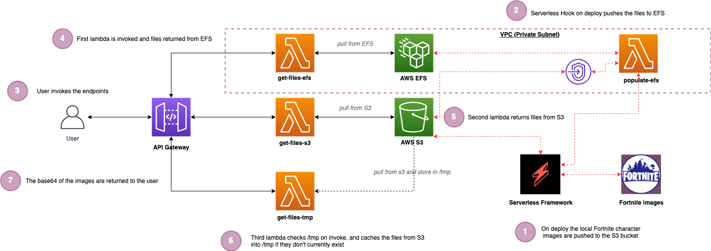

# Serverless Lambda Storage

## Introduction

Practical examples of using lambda ephemeral temp storage, S3 and EFS as a comparison, utilising the Serverless Framework and TypeScript. Supporting repo for the blog post: [Serverless lambda storage options 🚀](https://leejamesgilmore.medium.com/serverless-lambda-storage-options-6c483d1fa990)

This blog post covers three options, with code examples; and discussions around when to use each, the advantages and disadvantages, and relative speed:

✔️ AWS S3

✔️ AWS EFS

✔️ Lambda Ephemeral Storage (tmp)

### What are we building?

We are going to walk through building a solution which has an API with three endpoints to interact with each storage type via lambda, and just for fun we are working with images of Fortnite characters 😜

This will build out the following architecture:

### Architecture Overview

1. On deploy using the Serverless Framework we push the four Fortnite character images to an S3 bucket (Setup).
2. On successful deploy we also use 'Hooks' to invoke a lambda which pushes the same images to EFS (Setup).
3. The user can invoke any of the three endpoints for each storage type.
4. The EFS based lambda is invoked via API Gateway and returns the files from EFS (EFS).
5. The S3 based lambda is invoked via API Gateway and returns the files from S3 (S3).
6. The tmp based lambda checks to see if the files reside in the /tmp folder on the lambda itself already, and if not, it caches the same files from S3. On subsequent invokes via API Gateway the files are there already in temp to serve from (TMP).
7. All of the files are returned in base64 format. (_the following website is great for viewing base64 strings as images: https://codebeautify.org/base64-to-image-converter_)

> more in depth descriptions of the code and architecture can be found in the blog post

The images which are returned from the API in base64 format are:

> credit for images above go to Fortnite & https://www.epicgames.com/fortnite/

## Getting started

To get started, you can run the following commands from the root directory:

**Note: This will incur costs in your AWS account which you should account for.**

`npm i`

`npm run deploy:develop`

This will install the dependencies for the project and deploy the project to AWS.

> To remove the project you can run: npm run remove:develop

## Invoking the endpoints

Once deployed, you can invoke the three different endpoints using the postman file found here `./postman/`
